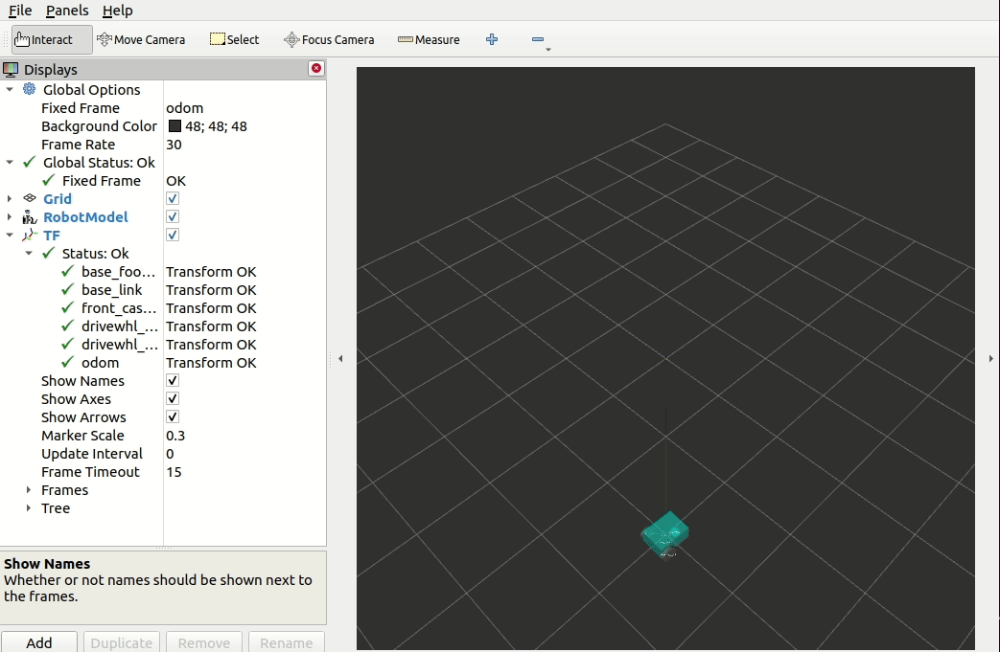
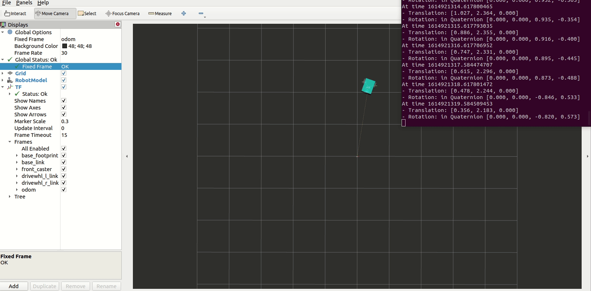

Odometry
########

The odometry system provides the estimate in the changes of the robots’ position and orientation. As stated in `REP 105 <https://www.ros.org/reps/rep-0105.html>`_, the required transformations that involve odometry are the ``map`` => ``odom`` and the ``odom`` => ``base_link``. The ``map`` => ``odom`` transformation is provided by global positioning systems such as localization, SLAM, GPS while the ``odom`` => ``base_link``  transformation is provided by the odometry system. 

The odometry information can be obtained from various sensors such as LIDAR, RADAR, wheel encoders, VIO, and IMU. To provide an accurate odometry information, multiple sensors can be used and the continuous data from different sensor inputs are fused using ``robot_localization``. ``robot_localization`` supports ``nav_msgs/Odometry``, ``geometry_msgs/PoseWithCovarianceStamped``, ``geometry_msgs/TwistWithCovarianceStamped``, and ``sensor_msgs/Imu`` messages. The fused sensor data are then published by ``robot_localization`` on the ``odometry/filtered`` and the ``accel/filtered`` topics (if enabled). It can also publish either the ``odom`` => ``base_link`` transform or the ``map`` => ``odom`` transform.

For the rest of this section, we will look at how to publish the odometry information, ``nav_msgs/Odometry``, then we will show how we set this ``nav_msgs/Odometry`` message as the input to the ``robot_localization``.

Publishing Odometry Information
*******************************

.. note::
  This subsection is adapted from `Publishing Odometry Information Over ROS <http://wiki.ros.org/navigation/Tutorials/RobotSetup/Odom>`__ tutorial in the ROS (1) Navigation documentation.

In this section, we see an example code of publishing a ``nav_msgs/Odometry`` message over ROS 2. To see the changes in the robot's position and orientation, we make our robot drive in circle.

Writing the Publisher
=====================

Under ``src`` directory, create a file name ``odom_publisher.cpp`` and paste the following code.

.. code-block:: cpp
  :linenos:

  #include "rclcpp/rclcpp.hpp"
  #include "std_msgs/msg/string.hpp"
  #include "nav_msgs/msg/odometry.hpp"
  #include <geometry_msgs/msg/transform_stamped.h>
  #include <tf2/LinearMath/Quaternion.h>
  #include <tf2_geometry_msgs/tf2_geometry_msgs.h>

  class OdomPublisher : public rclcpp::Node 
  {
    public:
      OdomPublisher()
      : Node("odom_publisher"), count_(0)
      {
      
      	// initialize publisher with message type of nav_msgs/Odometry message type and topic name of example/odom
        odom_pub_ = this->create_publisher<nav_msgs::msg::Odometry>("example/odom", 50);
      
        double x=0.0;
        double y=0.0;
        double th=0.0;
      
        double vx=0.1;
        double vy=-0.1;
        double vth=0.1;
      
        rclcpp::Time current_time, last_time;
        current_time = rclcpp::Node::now();
        last_time = rclcpp::Node::now();
      
        rclcpp::Rate r(1.0);
        while(rclcpp::ok()){
      
          current_time = rclcpp::Node::now();
        
          // compute odometry based on velocity
          double dt = (current_time - last_time).seconds();
          double delta_x = (vx * cos(th) - vy * sin(th)) * dt;
          double delta_y = (vx * sin(th) + vy * cos(th)) * dt;
          double delta_th = vth * dt;
        
          x += delta_x;
          y += delta_y;
          th += delta_th;
        
          // create quaternion msg from yaw
  	  tf2::Quaternion q;
	  q.setRPY(0,0,th);
	  geometry_msgs::msg::Quaternion odom_quat=tf2::toMsg(q);
	
      	   // message declaration
          nav_msgs::msg::Odometry odom;
      	  odom.header.stamp = current_time;
          odom.header.frame_id="odom";
          odom.child_frame_id="base_link";
        
      	  // set the position
      	  odom.pose.pose.position.x=x;
      	  odom.pose.pose.position.y=y;
      	  odom.pose.pose.position.z=0.0;
      	  odom.pose.pose.orientation = odom_quat;
      	
      	  //set the velocity
      	  odom.twist.twist.linear.x = vx;
      	  odom.twist.twist.linear.y = vy;
      	  odom.twist.twist.angular.z = vth;
      	
      	  // publish odometry over ROS
      	  odom_pub_->publish(odom);
      	
      	last_time = current_time;
      	r.sleep();
      }
      
    }
   
    rclcpp::Publisher<nav_msgs::msg::Odometry>::SharedPtr odom_pub_;
    size_t count_;
  };

  int main(int argc, char * argv[])
  {	
    rclcpp::init(argc, argv);
    rclcpp::spin(std::make_shared<OdomPublisher>());
    rclcpp::shutdown();
    return 0;
  }

.. seealso:: For more information on how to write a publisher in ROS 2, you can check `Writing a simple publisher and subscriber (Python)  <https://index.ros.org/doc/ros2/Tutorials/Writing-A-Simple-Py-Publisher-And-Subscriber/>`_ and `Writing a simple publisher and subscriber (C++)  <https://index.ros.org/doc/ros2/Tutorials/Writing-A-Simple-Cpp-Publisher-And-Subscriber/>`_.

Edit the Launch File
====================

Open ``launch/display.launch.py`` and paste the following lines above the ``return launch.LaunchDescription([`` line.

.. code-block:: shell
 
  odom_publisher_node = launch_ros.actions.Node(
         package='sam_bot_description',
         executable='odom_publisher',
         name='odom_publisher',
         output='screen',
    )

Then add the the following line below the ``robot_localization_node,`` line.

.. code-block:: shell

  odom_publisher_node

Add the dependencies
====================

Now, we need to add the dependencies needed by the publisher. Open ``package.xml`` and paste the following lines after the last ``<exec_depend>`` tag.  

.. code-block:: shell

  <depend>rclcpp</depend>
  <depend>std_msgs</depend>
  <depend>nav_msgs</depend>
  <depend>geometry_msgs</depend>
  <depend>tf2</depend>
  <depend>tf2_geometry_msgs</depend>

Next, open the ``CMakeLists.txt`` file and add the following lines below ``find_package(ament_cmake REQUIRED)``.

.. code-block:: shell

  find_package(rclcpp REQUIRED)
  find_package(std_msgs REQUIRED)
  find_package(nav_msgs REQUIRED)
  find_package(geometry_msgs REQUIRED)
  find_package(tf2 REQUIRED)
  find_package(tf2_geometry_msgs REQUIRED)
 
Then, add the executable ``odom_publisher`` by adding the following lines:

.. code-block:: shell

  add_executable(odom_publisher src/odom_publisher.cpp)
  ament_target_dependencies(odom_publisher rclcpp std_msgs nav_msgs geometry_msgs tf2 tf2_geometry_msgs)

Finally, add the ``install(TARGETS…)`` section, as shown below.

.. code-block:: shell

  install(
    TARGETS odom_publisher
    DESTINATION lib/${PROJECT_NAME}
  )
  

robot_localization
******************

``robot_localization`` has two state estimation nodes, namely the ``ekf_node`` and the ``ukf_node``. The ``ekf_node`` is an implementation of an extended Kalman filter while the ``ukf_node`` is an implementation of unscented kalman filter. It also implements ``navstat_transform_node`` to transform geographic coordinates into the robots’s world frame. More details on ``robot_localization`` is found `here <http://docs.ros.org/en/noetic/api/robot_localization/html/index.html>`_.

In this subsection, we will now configure ``robot_localization`` to use the ``nav_msgs/Odometry`` that we published in the previous subsection. For the purpose of this tutorial, suppose we use the ``ekf_node``.

First, we install the ``robot_localization`` package by executing the following:

.. code-block:: shell
 
  sudo apt install ros-<ros2-distro>-robot-localization

Next, we specify the parameters of the ``ekf_node`` using YAML. More information on the structure of a YAML file can be found `here <https://roboticsbackend.com/ros2-yaml-params/>`_. Navigate to the root of the project and create a directory named ``config``. Under ``config``, create a file named ``ekf.yaml``. Paste the following code in the ``ekf.yaml`` file.

.. code-block:: yaml
  :linenos:
  
  ekf_filter_node:
    ros__parameters:
        frequency: 30.0
        sensor_timeout: 0.1
        two_d_mode: false
        transform_time_offset: 0.0
        transform_timeout: 0.0
        print_diagnostics: true
        debug: false
        debug_out_file: /path/to/debug/file.txt
        publish_tf: true
        publish_acceleration: false

        map_frame: map              # Defaults to "map" if unspecified
        odom_frame: odom            # Defaults to "odom" if unspecified
        base_link_frame: base_link  # Defaults to "base_link" if unspecified
        world_frame: odom           # Defaults to the value of odom_frame if unspecified

        odom0: example/odom
        odom0_config: [true,  true,  false,
                       false, false, false,
                       false, false, false,
                       false, false, true,
                       false, false, false]
        odom0_queue_size: 2
        odom0_nodelay: false
        odom0_differential: false
        odom0_relative: false

        use_control: false
        stamped_control: false
        control_timeout: 0.2
        process_noise_covariance: [0.05, 0.0,    0.0,    0.0,    0.0,    0.0,    0.0,     0.0,     0.0,    0.0,    0.0,    0.0,    0.0,    0.0,    0.0,
                                   0.0,    0.05, 0.0,    0.0,    0.0,    0.0,    0.0,     0.0,     0.0,    0.0,    0.0,    0.0,    0.0,    0.0,    0.0,
                                   0.0,    0.0,    0.06, 0.0,    0.0,    0.0,    0.0,     0.0,     0.0,    0.0,    0.0,    0.0,    0.0,    0.0,    0.0,
                                   0.0,    0.0,    0.0,    0.03, 0.0,    0.0,    0.0,     0.0,     0.0,    0.0,    0.0,    0.0,    0.0,    0.0,    0.0,
                                   0.0,    0.0,    0.0,    0.0,    0.03, 0.0,    0.0,     0.0,     0.0,    0.0,    0.0,    0.0,    0.0,    0.0,    0.0,
                                   0.0,    0.0,    0.0,    0.0,    0.0,    0.06, 0.0,     0.0,     0.0,    0.0,    0.0,    0.0,    0.0,    0.0,    0.0,
                                   0.0,    0.0,    0.0,    0.0,    0.0,    0.0,    0.025, 0.0,     0.0,    0.0,    0.0,    0.0,    0.0,    0.0,    0.0,
                                   0.0,    0.0,    0.0,    0.0,    0.0,    0.0,    0.0,     0.025, 0.0,    0.0,    0.0,    0.0,    0.0,    0.0,    0.0,
                                   0.0,    0.0,    0.0,    0.0,    0.0,    0.0,    0.0,     0.0,     0.04, 0.0,    0.0,    0.0,    0.0,    0.0,    0.0,
                                   0.0,    0.0,    0.0,    0.0,    0.0,    0.0,    0.0,     0.0,     0.0,    0.01, 0.0,    0.0,    0.0,    0.0,    0.0,
                                   0.0,    0.0,    0.0,    0.0,    0.0,    0.0,    0.0,     0.0,     0.0,    0.0,    0.01, 0.0,    0.0,    0.0,    0.0,
                                   0.0,    0.0,    0.0,    0.0,    0.0,    0.0,    0.0,     0.0,     0.0,    0.0,    0.0,    0.02, 0.0,    0.0,    0.0,
                                   0.0,    0.0,    0.0,    0.0,    0.0,    0.0,    0.0,     0.0,     0.0,    0.0,    0.0,    0.0,    0.01, 0.0,    0.0,
                                   0.0,    0.0,    0.0,    0.0,    0.0,    0.0,    0.0,     0.0,     0.0,    0.0,    0.0,    0.0,    0.0,    0.01, 0.0,
                                   0.0,    0.0,    0.0,    0.0,    0.0,    0.0,    0.0,     0.0,     0.0,    0.0,    0.0,    0.0,    0.0,    0.0,    0.015]
        initial_estimate_covariance: [1e-9, 0.0,    0.0,    0.0,    0.0,    0.0,    0.0,    0.0,    0.0,    0.0,     0.0,     0.0,     0.0,    0.0,    0.0,
                                      0.0,    1e-9, 0.0,    0.0,    0.0,    0.0,    0.0,    0.0,    0.0,    0.0,     0.0,     0.0,     0.0,    0.0,    0.0,
                                      0.0,    0.0,    1e-9, 0.0,    0.0,    0.0,    0.0,    0.0,    0.0,    0.0,     0.0,     0.0,     0.0,    0.0,    0.0,
                                      0.0,    0.0,    0.0,    1e-9, 0.0,    0.0,    0.0,    0.0,    0.0,    0.0,     0.0,     0.0,     0.0,    0.0,    0.0,
                                      0.0,    0.0,    0.0,    0.0,    1e-9, 0.0,    0.0,    0.0,    0.0,    0.0,     0.0,     0.0,     0.0,    0.0,    0.0,
                                      0.0,    0.0,    0.0,    0.0,    0.0,    1e-9, 0.0,    0.0,    0.0,    0.0,     0.0,     0.0,     0.0,    0.0,    0.0,
                                      0.0,    0.0,    0.0,    0.0,    0.0,    0.0,    1e-9, 0.0,    0.0,    0.0,     0.0,     0.0,     0.0,    0.0,    0.0,
                                      0.0,    0.0,    0.0,    0.0,    0.0,    0.0,    0.0,    1e-9, 0.0,    0.0,     0.0,     0.0,     0.0,    0.0,    0.0,
                                      0.0,    0.0,    0.0,    0.0,    0.0,    0.0,    0.0,    0.0,    1e-9, 0.0,     0.0,     0.0,     0.0,    0.0,    0.0,
                                      0.0,    0.0,    0.0,    0.0,    0.0,    0.0,    0.0,    0.0,    0.0,    1e-9,  0.0,     0.0,     0.0,    0.0,    0.0,
                                      0.0,    0.0,    0.0,    0.0,    0.0,    0.0,    0.0,    0.0,    0.0,    0.0,     1e-9,  0.0,     0.0,    0.0,    0.0,
                                      0.0,    0.0,    0.0,    0.0,    0.0,    0.0,    0.0,    0.0,    0.0,    0.0,     0.0,     1e-9,  0.0,    0.0,    0.0,
                                      0.0,    0.0,    0.0,    0.0,    0.0,    0.0,    0.0,    0.0,    0.0,    0.0,     0.0,     0.0,     1e-9, 0.0,    0.0,
                                      0.0,    0.0,    0.0,    0.0,    0.0,    0.0,    0.0,    0.0,    0.0,    0.0,     0.0,     0.0,     0.0,    1e-9, 0.0,
                                      0.0,    0.0,    0.0,    0.0,    0.0,    0.0,    0.0,    0.0,    0.0,    0.0,     0.0,     0.0,     0.0,    0.0,    1e-9]
                                      
           
In our example, we will only use one ``nav_msgs/Odometry`` thus we set the parameters only for ``odom0``. In line 19 of ``ekf.yaml``, the value of ``odom0`` is the topic name of the publisher that we previously created in line 17 of ``odom_publisher.cpp``. 

.. seealso:: The description of all the parameters of the ``ekf_node`` and example of different sensor inputs can be found `here <https://github.com/cra-ros-pkg/robot_localization/blob/foxy-devel/params/ekf.yaml>`_.  

Edit the Launch File
====================

Now, let us add the ``ekf_node`` into the launch file. Open ``launch/display.launch.py`` and paste the following lines above the ``return launch.LaunchDescription([`` line.

.. code-block:: shell
 
  robot_localization_node = launch_ros.actions.Node(
         package='robot_localization',
         executable='ekf_node',
         name='ekf_filter_node',
         output='screen',
         parameters=[os.path.join(pkg_share, 'config/efk.yaml')],
    )

Then add the the following line below the ``rviz_node,`` line.

.. code-block:: shell

  robot_localization_node 

Add the dependencies
====================

Next, we need to add the ``robot_localization`` dependency. Open ``package.xml`` and add the following line below the last ``<exec_depend>`` tag.  

.. code-block:: shell

   <exec_depend>robot_localization</exec_depend>
   
Lastly, open ``CMakeLists.txt`` and append the ``config`` directory inside the ``install(DIRECTORY...)``, as shown in the snippet below.

.. code-block:: shell

  install(
    DIRECTORY src launch rviz config
    DESTINATION share/${PROJECT_NAME}
  )
   
  
Build and run
*************

Let us now build and run our package. Navigate to the root of the project and execute the following lines:

.. code-block:: shell

  colcon build
  . install/setup.bash
  ros2 launch sam_bot_description display.launch.py
  
RViz should open and you should see the ``sam_bot`` model. If you choose ``odom`` as the fixed frame in RViz, then you should see the robot moving as defined in the ``odom_publisher.cpp`` file.

We can check the ``odom`` => ``base_link`` transform by running the folllowing command in a separate command line.

.. code-block:: shell

  ros2 run tf2_ros tf2_echo odom base_link

You should see a continuous output as shown below.

.. code-block:: shell

  At time 1614699057.406191449
  - Translation: [0.248, -0.217, 0.000]
  - Rotation: in Quaternion [0.000, 0.000, 0.117, 0.993]
  At time 1614699058.405996247
  - Translation: [0.369, -0.291, 0.000]
  - Rotation: in Quaternion [0.000, 0.000, 0.166, 0.986]
  At time 1614699059.406035090
  - Translation: [0.496, -0.353, 0.000]
  - Rotation: in Quaternion [0.000, 0.000, 0.215, 0.977]
  
We can see in the gif below that the published transforms match the changes in the robot's position relative to the ``odom`` frame.

